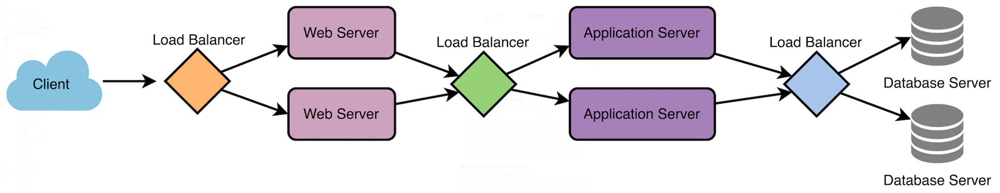

### What is `load balancing`? Why do we need it?

`Load Balancing` is the process of distributing incoming requests and traffic evenly across multiple servers.

We use `Load Balancing` to ensure high `availability`, `performance`, and `reliability` by avoiding the overload of a single server and avoiding downtime.

### Where is the `load balancer` located in a system design?

The `load balancer` is typically located between the client and the server accepting incoming network and application traffic and then distributes it evenly across multiple backend servers using various algorithms.

### Does placing the `load balancer` between the client and the server achieve maximum benefit?

Not necessarily. To utilize full scalability and redundancy, we can place the `load balancers` in three places:

- Between the `client` and the `web server`
- Between the `web servers` and `application/cache servers`
- Between the `application/cache servers` and the `database servers`.

### What is `Session Persistence`?

It is a technique used to ensure that subsequent requests made by the same client are always sent to the same backend server, maintaining session state and providing a consistent user experience.

### What is `SSL/TLS Termination`?

This is the process of decrypting `SSL/TLS encryption` at the load balancer layer to unburden the backend servers.

### How do `Load Balancers` work?

- The load balancer receives a request from a client or user.
- The load balancer evaluates the incoming request and determines which server or resource should handle the request. This is done based on a predefined load-balancing algorithm that takes into account factors such as server capacity, server response time, number of active connections, and geographic location.
- The load balancer forwards the incoming traffic to the selected server or resource.
- The server or resource processes the request and sends a response back to the load balancer.
- The load balancer receives the response from the server or resource and sends it to the client or user who made the request.
