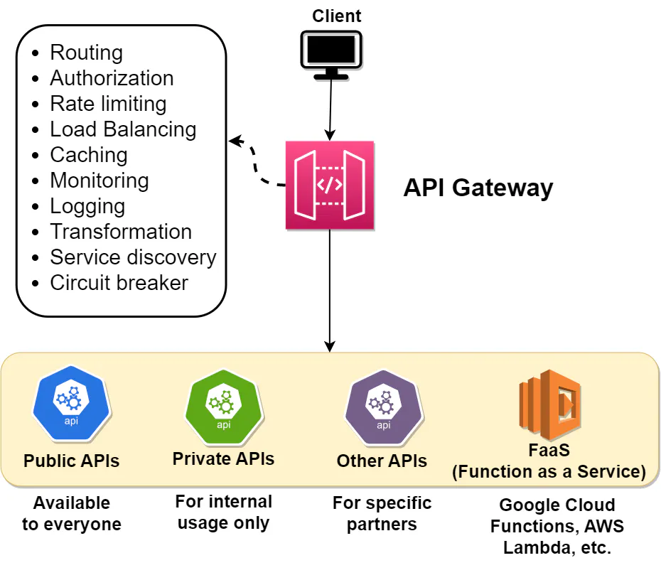
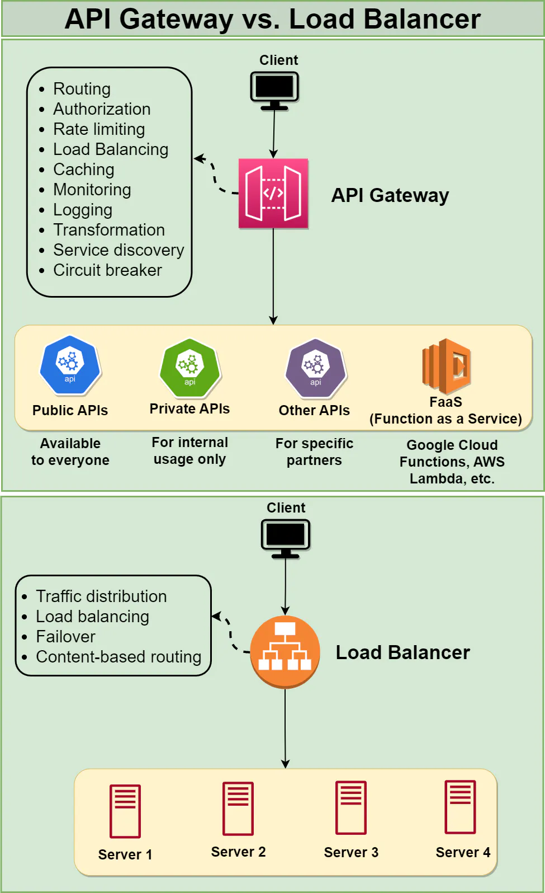

### What is an `API Gateway`?

An API Gateway is a server-side architectural component in a software system that acts as an intermediary between clients (such as web browsers, mobile apps, or other services) and backend services, microservices, or APIs.

Its main purpose is to provide a single entry point for external consumers to access the services and functionalities of the backend system. It receives client requests, forwards them to the appropriate microservice, and then returns the server’s response to the client.

The API gateway is responsible for tasks such as routing, authentication, and rate limiting. This enables microservices to focus on their individual tasks and improves the overall performance and scalability of the system.

### What is the difference between an `API Gateway` and a `load balancer`?

- `API Gateway`: An API gateway is a type of middleware that sits between a client and a collection of microservices. Its main purpose is to `route requests from clients to the appropriate microservice and then to return the response from the microservice back to the client`. An API gateway can also perform other tasks such as authorization, rate limiting, and caching.

  An API gateway is typically used to handle requests for APIs, which are web-based interfaces that allow applications to interact with each other over the internet. These requests typically have a specific URL that identifies the API that the client is trying to access, and the API gateway routes the request to the appropriate microservice based on this URL.

- `Load balancer`: A load balancer, on the other hand, is a type of infrastructure that distributes incoming requests evenly across a group of backend servers in order to improve the performance and availability of a system. Load balancers are typically used to `handle requests that are sent to a single, well-known IP address, and then route them to one of many possible backend servers` based on factors such as server performance and availability.

  A load balancer, on the other hand, is typically used to handle requests that are sent to a single, well-known IP address, and then routes them to one of many possible backend servers based on factors such as server performance and availability.

### Mention some purposes of an `API Gateway`.

- #### Routing
  The API gateway receives requests from clients and routes them to the appropriate microservice. This enables clients to access the various microservices through a single entry point, simplifying the overall system design.
- #### Rate Limiting & throttling
  You can rate limit client access to microservices with an API gateway. This can help prevent denial of service attacks and other types of malicious behavior.
- #### Caching
  The API gateway can cache responses from the microservices, reducing the number of requests that need to be forwarded to the microservices and improving the overall performance of the system.
- #### Authentication & Authorization
  The API gateway can be used to authenticate clients and enforce access control policies for the microservices. This helps to ensure that only authorized clients can access the microservices and helps to prevent unauthorized access.
- #### Load Balancing
  The API gateway can distribute incoming requests among multiple instances of a microservice, enabling the system to handle a larger number of requests and improving its overall performance and scalability.
- #### Request & Response Validation
  The API gateway can be used to validate the requests and responses from the microservices to ensure that they conform to the expected format and structure. This can help to prevent errors and ensure that the microservices are functioning properly.
- #### Transformation
  The API gateway can be used to transform the data received from the microservices into a format that is more convenient for the clients to use. This can include tasks such as converting between different data formats, such as XML and JSON, or aggregating data from multiple microservices into a single response.
- #### API Documentation
  The API Gateway can generate and serve API documentation based on a standard format, such as Swagger or OpenAPI, making it easier for developers to understand and use the APIs.
- #### Monitoring
  The API gateway can collect metrics and other data about requests and responses, providing valuable insights into the performance and behavior of the microservices. This can help to identify and diagnose problems, and improve the overall reliability and resilience of the system.
- #### Circuit Breaker
  The API gateway can be used to implement a circuit breaker pattern, which can help to prevent a single failed microservice from bringing down the entire system. The circuit breaker can monitor the health of the microservices and automatically fail over to a backup service if necessary.
- #### Service Discovery
  The API gateway can be used to discover the available microservices and their locations, enabling the clients to access them without knowing their specific addresses. This can make it easier to add new microservices or make changes to the existing ones without impacting the clients.
- #### API Versioning
  The API Gateway can manage multiple versions of an API, allowing developers to introduce new features or make changes to existing ones without disrupting existing clients.
- #### Error Handling
  The API Gateway can provide a consistent way to handle errors and generate error responses to clients, even when backend services are unavailable or return unexpected results.
- #### Service Aggregation
  The API Gateway can combine responses from multiple backend services into a single response for the client, reducing the number of requests a client has to make and simplifying the integration process.
- #### Web Application Firewall (WAF)
  The API Gateway can incorporate a Web Application Firewall to protect backend services from common web-based threats, such as SQL injection, cross-site scripting (XSS), or distributed denial-of-service (DDoS) attacks.

### List some advantages and disadvantages of using an API gateway.

#### Advantages

- **Improved Performance**: The API Gateway can cache responses, rate limit requests, and optimize communication between clients and backend services, resulting in improved performance and reduced latency for end users.
- **Simplified System Design**: The API Gateway provides a single entry point for all API requests, making it easier to manage, monitor, and maintain APIs across multiple backend services. This simplifies the development and deployment process and reduces the complexity of the overall system.
- **Enhanced Security**: The API Gateway can enforce authentication and authorization policies, helping protect backend services from unauthorized access or abuse. By handling security at the gateway level, developers can focus on implementing core business logic in their services without worrying about implementing security measures in each service individually.
- **Improved Scalability**: The API gateway can distribute incoming requests among multiple instances of a microservice, enabling the system to scale more easily and handle a larger number of requests.
- **Better Monitoring & Visibility**: The API gateway can collect metrics and other data about the requests and responses, providing valuable insights into the performance and behavior of the system. This can help to identify and diagnose problems, and improve the overall reliability and resilience of the system.
- **Simplified Client Integration**: By providing a consistent and unified interface for clients to access multiple backend services, the API Gateway simplifies client-side development and reduces the need for clients to manage complex service interactions.
- **Protocol & Data Format Transformation**: The API Gateway can convert requests and responses between different protocols (e.g., HTTP to gRPC) or data formats (e.g., JSON to XML), enabling greater flexibility in how clients and services communicate and easing the integration process.
- **API Versioning & Backward Compatibility**: The API Gateway can manage multiple versions of an API, allowing developers to introduce new features or make changes without breaking existing clients. This enables a smoother transition for clients and reduces the risk of service disruptions.
- **Enhanced Error Handling**: The API Gateway can provide a consistent way to handle errors and generate error responses, improving the user experience and making it easier to diagnose and fix issues.
- **Load Balancing & Fault Tolerance**: The API Gateway can distribute incoming traffic evenly among multiple instances of a backend service, improving performance and fault tolerance. This helps ensure that the system remains responsive and available even if individual services or instances experience failures or become overloaded.

#### Disadvantages

- **Additional Complexity**: Introducing an API Gateway adds an extra layer of complexity to your architecture. Developers need to understand and manage this additional component, which might require additional knowledge, skills, and tools.
- **Single Point of Failure**: If not configured correctly, the API Gateway could become a single point of failure in your system. If the gateway experiences an outage or performance issues, it can affect the entire system. It is crucial to ensure proper redundancy, scalability, and fault tolerance when deploying an API Gateway.
- **Latency**: The API Gateway adds an extra hop in the request-response path, which could introduce some latency, especially if the gateway is responsible for performing complex tasks like request/response transformation or authentication. However, the impact is usually minimal and can be mitigated through performance optimizations, caching, and load balancing.
- **Vendor Lock-in**: If you use a managed API Gateway service provided by a specific cloud provider or vendor, you may become dependent on their infrastructure, pricing, and feature set. This could make it more challenging to migrate your APIs to a different provider or platform in the future.
- **Cost**: Running an API Gateway, especially in high-traffic scenarios, can add to the overall cost of your infrastructure. This may include the cost of hosting, licensing, or using managed API Gateway services from cloud providers.
- **Maintenance Overhead**: An API Gateway requires monitoring, maintenance, and regular updates to ensure its security and reliability. This can increase the operational overhead for your development team, particularly if you self-host and manage your own API Gateway.
- **Configuration Complexity**: API Gateways often come with a wide range of features and configuration options. Setting up and managing these configurations can be complex and time-consuming, especially when dealing with multiple environments or large-scale deployments.

### 
