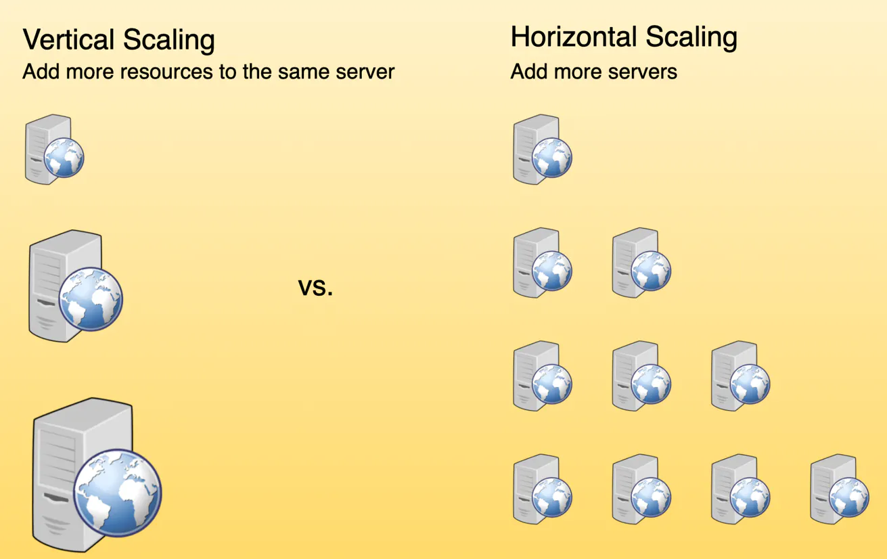

### What is `Scalability`?

`Scalability` is the ability of a system to handle an increasing workload, either by adding more resources (`scaling out`) or by upgrading the capacity of existing resources (`scaling up`).

### What are the types of `Scalability`?

#### Horizontal Scaling (`scaling out`)

Horizontal scaling, also known as scaling out, involves adding more machines or nodes to a system to distribute the workload evenly. This approach allows the system to handle an increased number of requests without overloading individual nodes. Horizontal scaling is particularly useful in distributed systems because it provides a cost-effective way to manage fluctuating workloads and maintain high availability.

#### Vertical Scaling (`scaling up`)

Vertical scaling, or scaling up, refers to increasing the capacity of individual nodes within a system. This can be achieved by upgrading the hardware, such as adding more CPU, memory, or storage. Vertical scaling can help improve the performance of a system by allowing it to handle more workloads on a single node. However, this approach has limitations, as there is a physical limit to the amount of resources that can be added to a single machine, and it can also lead to single points of failure.

Good examples of horizontal scaling are Cassandra and MongoDB as they both provide an easy way to scale horizontally by adding more machines to meet growing needs. Similarly, a good example of vertical scaling is MySQL as it allows for an easy way to scale vertically by switching from smaller to bigger machines. However, this process often involves downtime.

### What is `Availability`?

Availability is a measure of how accessible and reliable a system is to its users. In distributed systems, high availability is crucial to ensure that the system remains operational even in the face of failures or increased demand.

### What do you mean by `high availability` with reference to distributed systems?

High availability is often measured in terms of uptime, which is the ratio of time that a system is operational to the total time it is supposed to be operational. Achieving high availability involves minimizing planned and unplanned downtime, eliminating single points of failure, and implementing redundant systems and processes.

### What are some strategies for `Achieving High Availability`?

1. **High Availability through Redundancy and Replication**

   One of the most effective strategies for achieving high availability is redundancy and replication. By duplicating critical components or entire systems, organizations can ensure that if one fails, the redundant system takes over seamlessly, avoiding any interruption in service. Replication involves creating multiple copies of data, ensuring that it is available even if one copy becomes inaccessible.

   Redundancy and replication are commonly used in mission-critical systems such as data centers, where multiple servers are deployed to handle the workload. In the event of a hardware failure or system crash, the redundant server takes over, ensuring uninterrupted service for users.

2. **Availability through Load Balancing**

   Load balancing involves distributing workloads across multiple servers, ensuring that no single server is overwhelmed. Through intelligent load-balancing algorithms, organizations can optimize resource utilization, prevent bottlenecks, and enhance high availability by evenly distributing traffic.

   Load balancing is particularly useful in web applications, where a large number of users access the system simultaneously. By distributing incoming requests across multiple servers, load balancers ensure that no single server becomes overloaded, leading to improved performance and availability.

3. **Availability through Distributed Data Storage**

   Storing data across multiple locations or data centers enhances high availability by reducing the risk of data loss or corruption. Distributed data storage systems replicate data across geographically diverse locations, ensuring that even if one site experiences an outage, data remains accessible from other locations.

   Distributed data storage is crucial for organizations that deal with large volumes of data and cannot afford to lose it. By replicating data across multiple sites, organizations can ensure that data is always available, even in the event of a catastrophic failure at one location.

4. **Availability and Consistency Models (Strong, Weak, Eventual)**

   Consistency models define how a distributed system maintains a coherent and up-to-date view of its data across all replicas. Different consistency models provide different trade-offs between availability, performance, and data correctness. Strong consistency ensures that all replicas have the same data at all times, at the cost of reduced availability and performance. Weak consistency allows for temporary inconsistencies between replicas, with the advantage of improved availability and performance. Eventual consistency guarantees that all replicas will eventually converge to the same data, providing a balance between consistency, availability, and performance.

5. **Availability through Health Monitoring and Alerts**

   Implementing robust health monitoring systems ensures that organizations can proactively identify and address potential issues before they impact system availability. Real-time monitoring and automated alerts enable timely response and rapid resolution of problems, minimizing downtime.

   Health monitoring involves continuously monitoring system performance, resource utilization, and various metrics to detect any anomalies or potential issues. Alerts are triggered when predefined thresholds are exceeded, allowing IT teams to take immediate action and prevent service disruptions.

6. **Availability through Regular System Maintenance and Updates**

   Regular system maintenance and updates are crucial for achieving high availability. By keeping systems up to date with the latest patches, security enhancements, and bug fixes, organizations can mitigate the risk of failures and vulnerabilities that could compromise system availability.

   System maintenance involves tasks such as hardware inspections, software updates, and routine checks to ensure that all components are functioning correctly. By staying proactive and addressing any potential issues promptly, organizations can maintain high availability and minimize the impact of system failures.

7. **Availability through Geographic Distribution**

   Geographic distribution is a strategy that involves deploying system components across multiple locations or data centers. This ensures that even if one region or data center experiences an outage, users can still access the system from other geographically dispersed locations.

### What are some factors to be considered for optimizing `latency` and `performance` in distributed systems?

Some factors to cosider are:

- #### Data Locality
  Data locality refers to the organization and distribution of data within a distributed system to minimize the amount of data that needs to be transferred between nodes. By storing related data close together or near the nodes that access it most frequently, you can reduce the latency associated with data retrieval and improve overall performance. Techniques to achieve data locality include data partitioning, sharding, and data replication.
- #### Load Balancing
  Load balancing is the process of distributing incoming network traffic or computational workload across multiple nodes or resources to ensure that no single node is overwhelmed. This helps to optimize resource utilization, minimize response times, and prevent system overloads. Various load balancing algorithms, such as round-robin, least connections, and consistent hashing, can be employed to achieve efficient load distribution and improved system performance.
- #### Caching Strategies
  Caching is a technique used to store frequently accessed data or computed results temporarily, allowing the system to quickly retrieve the data from cache instead of recalculating or fetching it from the primary data source. By implementing effective caching strategies, you can significantly reduce latency and improve the performance of your distributed system. Common caching strategies include in-memory caching, distributed caching, and content delivery networks (CDNs).

### What is `Concurrency Control` w.r.t distributed systems?

`Concurrency control` is the process of managing simultaneous access to shared resources or data in a distributed system. It ensures that multiple processes can work together efficiently while avoiding conflicts or inconsistencies. Techniques for implementing concurrency control include:

- _Locking_: Locks are used to restrict access to shared resources or data, ensuring that only one process can access them at a time.

- _Optimistic concurrency control_: This approach assumes that conflicts are rare and allows multiple processes to work simultaneously. Conflicts are detected and resolved later, usually through a validation and rollback mechanism.

- _Transactional memory_: This technique uses transactions to group together multiple operations that should be executed atomically, ensuring data consistency and isolation.

### What is `Synchronization` w.r.t distributed systems?

`Synchronization` is the process of coordinating the execution of multiple processes or threads in a distributed system to ensure correct operation. Synchronization can be achieved using various mechanisms, such as:

- _Barriers_: Barriers are used to synchronize the execution of multiple processes or threads, ensuring that they all reach a specific point before proceeding.
- _Semaphores_: Semaphores are signaling mechanisms that control access to shared resources and maintain synchronization among multiple processes or threads.
- _Condition variables_: Condition variables allow processes or threads to wait for specific conditions to be met before proceeding with their execution.

### What are `Consistency Models` w.r.t distributed systems?

In distributed systems, consistency models define the rules for maintaining data consistency across multiple nodes or components. Various consistency models, such as strict consistency, sequential consistency, eventual consistency, and causal consistency, provide different levels of guarantees for data consistency and can impact the overall system performance, availability, and complexity.

### What are `Cordination Services` w.r.t distributed systems?

Coordination services are specialized components or tools that help manage distributed systems' complexity by providing a set of abstractions and primitives for tasks like configuration management, service discovery, leader election, and distributed locking. Examples of coordination services include Apache ZooKeeper, etcd, and Consul.

### What is `Intrusion Detection and Prevention` w.r.t distributed systems?

Intrusion detection and prevention systems (IDPS) are designed to monitor network traffic, detect malicious activities or policy violations, and take appropriate actions to mitigate potential threats. By deploying IDPS solutions in your distributed system, you can identify and respond to security incidents more effectively, thus reducing the risk of data breaches and system compromise.

### What are some components of monitoring and observability in distributed systems?

- #### _Metrics Collection_:

  Metrics are quantitative measurements that provide insights into the performance, health, and behavior of a distributed system. Collecting and analyzing metrics, such as latency, throughput, error rates, and resource utilization, can help identify performance bottlenecks, potential issues, and areas for improvement. Tools like Prometheus, Graphite, or InfluxDB can be used to collect, store, and query metrics in distributed systems.

- #### _Distributed Tracing_:

  Distributed tracing is a technique for tracking and analyzing requests as they flow through a distributed system, allowing you to understand the end-to-end performance and identify issues in specific components or services. Implementing distributed tracing using tools like Jaeger, Zipkin, or OpenTelemetry can provide valuable insights into the behavior of your system, making it easier to debug and optimize.

- #### _Logging_:

  Logs are records of events or messages generated by components of a distributed system, providing a detailed view of system activity and helping identify issues or anomalies. Collecting, centralizing, and analyzing logs from all services and nodes in a distributed system can provide valuable insights into system behavior and help with debugging and troubleshooting. Tools like Elasticsearch, Logstash, and Kibana (ELK Stack) or Graylog can be used for log aggregation and analysis.

- #### _Alerting and Anomaly Detection_:

  Alerting and anomaly detection involve monitoring the distributed system for unusual behavior or performance issues and notifying the appropriate teams when such events occur. By setting up alerts based on predefined thresholds or detecting anomalies using machine learning algorithms, you can proactively identify issues and take corrective actions before they impact users or system performance. Tools like Grafana, PagerDuty, or Sensu can help you set up alerting and anomaly detection for your distributed system.

- #### _Visualization and Dashboards_:
  Visualizing metrics, traces, and logs in an easy-to-understand format can help you better comprehend the state of your distributed system and make data-driven decisions. Dashboards are an effective way to aggregate and display this information, providing a unified view of your system's performance and health. Tools like Grafana, Kibana, or Datadog can be used to create customizable dashboards for monitoring and observability purposes.

### 