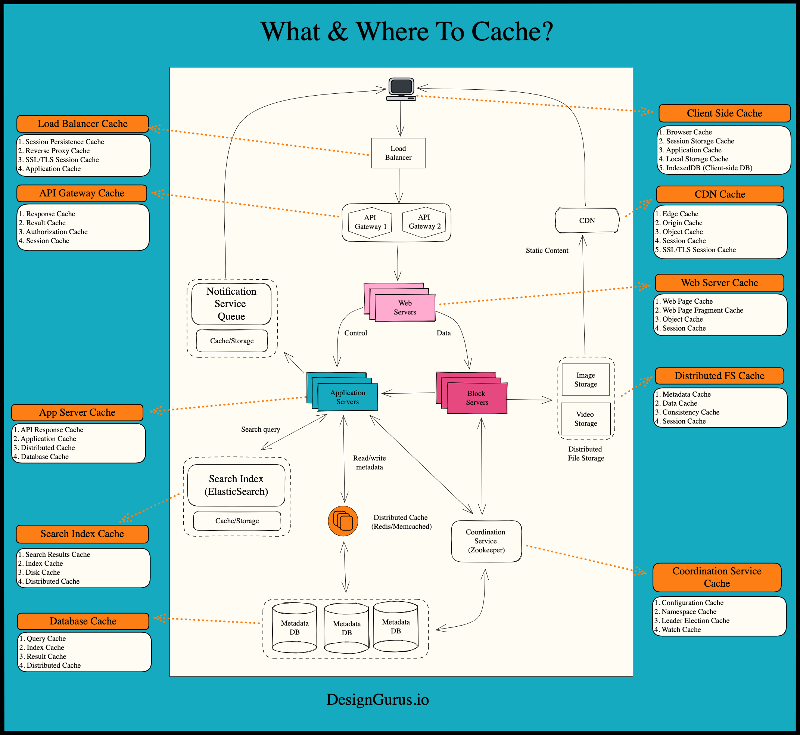

### What is Caching?

The cache is a high-speed storage layer that sits between the application and the original source of the data, such as a database, a file system, or a remote web service. When data is requested by the application, it is first checked in the cache. If the data is found in the cache, it is returned to the application. If the data is not found in the cache, it is retrieved from its original source, stored in the cache for future use, and returned to the application.

### Why do we need `caching`?

The goal of caching is to reduce the number of times data needs to be fetched from its original source, which can result in faster processing and reduced latency.

### What are some ways to implement `caching`?

- `In-memory caching` stores data in the main memory of the computer, which is faster to access than disk storage. In-memory caching is useful for frequently accessed data that can fit into the available memory. This type of caching is commonly used for caching API responses, session data, and web page fragments. To implement in-memory caching, software engineers can use various techniques, including using a cache library like Memcached or Redis, or implementing custom caching logic within the application code.
- `Disk caching` stores data on the hard disk, which is slower than main memory but faster than retrieving data from a remote source. Disk caching is useful for data that is too large to fit in memory or for data that needs to persist between application restarts. This type of caching is commonly used for caching database queries and file system data.
- `Database caching` stores frequently accessed data in the database itself, reducing the need to access external storage. This type of caching is useful for data that is stored in a database and frequently accessed by multiple users. Database caching can be implemented using a variety of techniques, including database query caching and result set caching.
- `CDN caching` stores data on a distributed network of servers, reducing the latency of accessing data from remote locations. This type of caching is useful for data that is accessed from multiple locations around the world, such as images, videos, and other static assets. CDN caching is commonly used for content delivery networks and large-scale web applications.
- `Client-side caching` occurs on the client device, such as a web browser or mobile app. Client-side caching stores frequently accessed data, such as images, CSS, or JavaScript files, to reduce the need for repeated requests to the server. Examples of client-side caching include browser caching and local storage.
- `Server-side caching` occurs on the server, typically in web applications or other backend systems. Server-side caching can be used to store frequently accessed data, precomputed results, or intermediate processing results to improve the performance of the server. Examples of server-side caching include full-page caching, fragment caching, and object caching.
- `DNS caching`:
  DNS cache is a type of cache used in the Domain Name System (DNS) to store the results of DNS queries for a period of time. When a user requests to access a website, their computer sends a DNS query to a DNS server to resolve the website’s domain name to an IP address. The DNS server responds with the IP address, and the user’s computer can then access the website using the IP address.

### What is `Cache`?

A temporary storage location for data or computation results, typically designed for fast access and retrieval.

### What is `Cache Hit`?

When a requested data item or computation result is found in the cache.

### What is `Cache Miss`?

When a requested data item or computation result is not found in the cache and needs to be fetched from the original data source or recalculated.

### What is `Cache Eviction`?

The process of removing data from the cache, typically to make room for new data or based on a predefined cache eviction policy.

### What is `Cache Staleness`?

When the data in the cache is outdated compared to the original data source.

### Why is `caching` important?

- #### _Reduced latency_

  By serving data from the cache, which is typically faster to access than the original data source, caching can significantly reduce the time it takes to retrieve the data.

- #### _Improved system performance_

  Caching can significantly improve the performance of an application by reducing the number of times data needs to be fetched from its original source. Since cached data can be retrieved faster than from the original source, this results in a significant reduction in processing time, which leads to a more responsive application.

- #### _Reduced network load_

  Caching can also reduce network load by minimizing the amount of data that needs to be transmitted over the network. Since cached data is stored locally, there is no need to fetch data from the original source, reducing the amount of data that needs to be transferred over the network.

- #### _Increased scalability_

  Caching can improve the scalability of an application by reducing the load on the original source. By storing frequently accessed data in a cache, the original source is less likely to be overwhelmed with requests, making it more scalable.

- #### _Better user experience_
  Faster response times and reduced latency can lead to a better user experience. Applications that load quickly and respond to user requests in a timely manner are more likely to be used and preferred by users.

### What & Where to Cache?

### What is a `Cache Replacement Policy`? List some common ones.

A cache replacement policy determines which items in the cache should be removed when the cache becomes full. Some common ones are:

1. #### *Least Recently Used (LRU)*
   LRU is a cache replacement policy that removes the least recently used item from the cache when it becomes full. This policy assumes that items that have been accessed more recently are more likely to be accessed again in the future.

2. #### *Least Frequently Used (LFU)*
   LFU is a cache replacement policy that removes the least frequently used item from the cache when it becomes full. This policy assumes that items that have been accessed more frequently are more likely to be accessed again in the future.

3. #### *First In, First Out (FIFO)*
   FIFO is a cache replacement policy that removes the oldest item from the cache when it becomes full. This policy assumes that the oldest items in the cache are the least likely to be accessed again in the future.

4. #### *Random Replacement*
   Random replacement is a cache replacement policy that removes a random item from the cache when it becomes full. This policy doesn’t make any assumptions about the likelihood of future access and can be useful when the access pattern is unpredictable.

LRU and LFU are generally more effective than FIFO and random replacement since they take into account the access pattern of the cache. However, LRU and LFU can be more expensive to implement since they require maintaining additional data structures to track access patterns. FIFO and random replacement are simpler to implement but may not be as effective in optimizing cache performance.

### 