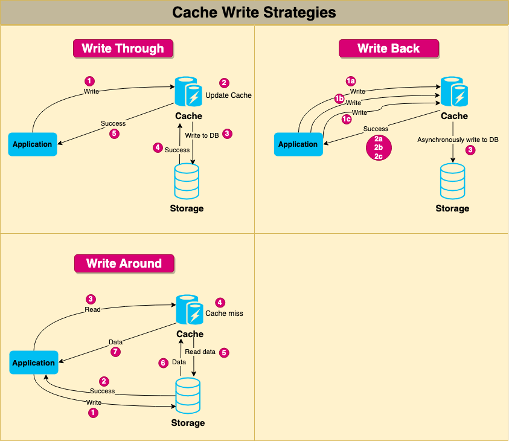

### What is Caching?

The cache is a high-speed storage layer that sits between the application and the original source of the data, such as a database, a file system, or a remote web service. When data is requested by the application, it is first checked in the cache. If the data is found in the cache, it is returned to the application. If the data is not found in the cache, it is retrieved from its original source, stored in the cache for future use, and returned to the application.

### Why do we need `caching`?

The goal of caching is to reduce the number of times data needs to be fetched from its original source, which can result in faster processing and reduced latency.

### What are some ways to implement `caching`?

- `In-memory caching` stores data in the main memory of the computer, which is faster to access than disk storage. In-memory caching is useful for frequently accessed data that can fit into the available memory. This type of caching is commonly used for caching API responses, session data, and web page fragments. To implement in-memory caching, software engineers can use various techniques, including using a cache library like Memcached or Redis, or implementing custom caching logic within the application code.
- `Disk caching` stores data on the hard disk, which is slower than main memory but faster than retrieving data from a remote source. Disk caching is useful for data that is too large to fit in memory or for data that needs to persist between application restarts. This type of caching is commonly used for caching database queries and file system data.
- `Database caching` stores frequently accessed data in the database itself, reducing the need to access external storage. This type of caching is useful for data that is stored in a database and frequently accessed by multiple users. Database caching can be implemented using a variety of techniques, including database query caching and result set caching.
- `CDN caching` stores data on a distributed network of servers, reducing the latency of accessing data from remote locations. This type of caching is useful for data that is accessed from multiple locations around the world, such as images, videos, and other static assets. CDN caching is commonly used for content delivery networks and large-scale web applications.
- `Client-side caching` occurs on the client device, such as a web browser or mobile app. Client-side caching stores frequently accessed data, such as images, CSS, or JavaScript files, to reduce the need for repeated requests to the server. Examples of client-side caching include browser caching and local storage.
- `Server-side caching` occurs on the server, typically in web applications or other backend systems. Server-side caching can be used to store frequently accessed data, precomputed results, or intermediate processing results to improve the performance of the server. Examples of server-side caching include full-page caching, fragment caching, and object caching.
- `DNS caching`:
  DNS cache is a type of cache used in the Domain Name System (DNS) to store the results of DNS queries for a period of time. When a user requests to access a website, their computer sends a DNS query to a DNS server to resolve the website’s domain name to an IP address. The DNS server responds with the IP address, and the user’s computer can then access the website using the IP address.

### What is `Cache`?

A temporary storage location for data or computation results, typically designed for fast access and retrieval.

### What is `Cache Hit`?

When a requested data item or computation result is found in the cache.

### What is `Cache Miss`?

When a requested data item or computation result is not found in the cache and needs to be fetched from the original data source or recalculated.

### What is `Cache Eviction`?

The process of removing data from the cache, typically to make room for new data or based on a predefined cache eviction policy.

### What is `Cache Staleness`?

When the data in the cache is outdated compared to the original data source.

### Why is `caching` important?

- #### _Reduced latency_

  By serving data from the cache, which is typically faster to access than the original data source, caching can significantly reduce the time it takes to retrieve the data.

- #### _Improved system performance_

  Caching can significantly improve the performance of an application by reducing the number of times data needs to be fetched from its original source. Since cached data can be retrieved faster than from the original source, this results in a significant reduction in processing time, which leads to a more responsive application.

- #### _Reduced network load_

  Caching can also reduce network load by minimizing the amount of data that needs to be transmitted over the network. Since cached data is stored locally, there is no need to fetch data from the original source, reducing the amount of data that needs to be transferred over the network.

- #### _Increased scalability_

  Caching can improve the scalability of an application by reducing the load on the original source. By storing frequently accessed data in a cache, the original source is less likely to be overwhelmed with requests, making it more scalable.

- #### _Better user experience_
  Faster response times and reduced latency can lead to a better user experience. Applications that load quickly and respond to user requests in a timely manner are more likely to be used and preferred by users.

### What & Where to Cache?

### What is a `Cache Replacement Policy`? List some common ones.

A cache replacement policy determines which items in the cache should be removed when the cache becomes full. Some common ones are:

1. #### _Least Recently Used (LRU)_

   LRU is a cache replacement policy that removes the least recently used item from the cache when it becomes full. This policy assumes that items that have been accessed more recently are more likely to be accessed again in the future.

2. #### _Least Frequently Used (LFU)_

   LFU is a cache replacement policy that removes the least frequently used item from the cache when it becomes full. This policy assumes that items that have been accessed more frequently are more likely to be accessed again in the future.

3. #### _First In, First Out (FIFO)_

   FIFO is a cache replacement policy that removes the oldest item from the cache when it becomes full. This policy assumes that the oldest items in the cache are the least likely to be accessed again in the future.

4. #### _Random Replacement_
   Random replacement is a cache replacement policy that removes a random item from the cache when it becomes full. This policy doesn’t make any assumptions about the likelihood of future access and can be useful when the access pattern is unpredictable.

LRU and LFU are generally more effective than FIFO and random replacement since they take into account the access pattern of the cache. However, LRU and LFU can be more expensive to implement since they require maintaining additional data structures to track access patterns. FIFO and random replacement are simpler to implement but may not be as effective in optimizing cache performance.

### What is `Cache Invalidation`? List some `Cache Invalidation Strategies`.

Caching requires some maintenance to keep the cache coherent with the source of truth (e.g., database). If the data is modified in the database, it should be invalidated in the cache; if not, this can cause inconsistent application behavior.

1. #### _Write-through cache_

   Under this scheme, data is written into the cache and the corresponding database simultaneously. The cached data allows for fast retrieval and, since the same data gets written in the permanent storage, we will have complete data consistency between the cache and the storage. Also, this scheme ensures that nothing will get lost in case of a crash, power failure, or other system disruptions. Although, write-through minimizes the risk of data loss, since every write operation must be done twice before returning success to the client, this scheme has the disadvantage of higher latency for write operations.

2. #### _Write-around cache_

   This technique is similar to write-through cache, but data is written directly to permanent storage, bypassing the cache. This can reduce the cache being flooded with write operations that will not subsequently be re-read, but has the disadvantage that a read request for recently written data will create a “cache miss” and must be read from slower back-end storage and experience higher latency.

3. #### _Write-back cache_

   Under this scheme, data is written to cache alone, and completion is immediately confirmed to the client. The write to the permanent storage is done based on certain conditions, for example, when the system needs some free space. This results in low-latency and high-throughput for write-intensive applications; however, this speed comes with the risk of data loss in case of a crash or other adverse event because the only copy of the written data is in the cache.

4. #### _Write-behind cache_
   It is quite similar to write-back cache. In this scheme, data is written to the cache and acknowledged to the application immediately, but it is not immediately written to the permanent storage. Instead, the write operation is deferred, and the data is eventually written to the permanent storage at a later time. The main difference between write-back cache and write-behind cache is when the data is written to the permanent storage. In write-back caching, data is only written to the permanent storage when it is necessary for the cache to free up space, while in write-behind caching, data is written to the permanent storage at specified intervals.

### List some `Cache Invalidation Methods`.

- #### _Purge_

  The purge method removes cached content for a specific object, URL, or a set of URLs. It’s typically used when there is an update or change to the content and the cached version is no longer valid. When a purge request is received, the cached content is immediately removed, and the next request for the content will be served directly from the origin server.

- #### _Refresh_

  Fetches requested content from the origin server, even if cached content is available. When a refresh request is received, the cached content is updated with the latest version from the origin server, ensuring that the content is up-to-date. Unlike a purge, a refresh request doesn’t remove the existing cached content; instead, it updates it with the latest version.

- #### _Ban_

  The ban method invalidates cached content based on specific criteria, such as a URL pattern or header. When a ban request is received, any cached content that matches the specified criteria is immediately removed, and subsequent requests for the content will be served directly from the origin server.

- #### _Time-to-live (TTL) expiration_

  This method involves setting a time-to-live value for cached content, after which the content is considered stale and must be refreshed. When a request is received for the content, the cache checks the time-to-live value and serves the cached content only if the value hasn’t expired. If the value has expired, the cache fetches the latest version of the content from the origin server and caches it.

- #### _Stale-while-revalidate_
  This method is used in web browsers and CDNs to serve stale content from the cache while the content is being updated in the background. When a request is received for a piece of content, the cached version is immediately served to the user, and an asynchronous request is made to the origin server to fetch the latest version of the content. Once the latest version is available, the cached version is updated. This method ensures that the user is always served content quickly, even if the cached version is slightly outdated.
