## Chapter 1: Scale From Zero to Millions of Users

### Single Server Setup

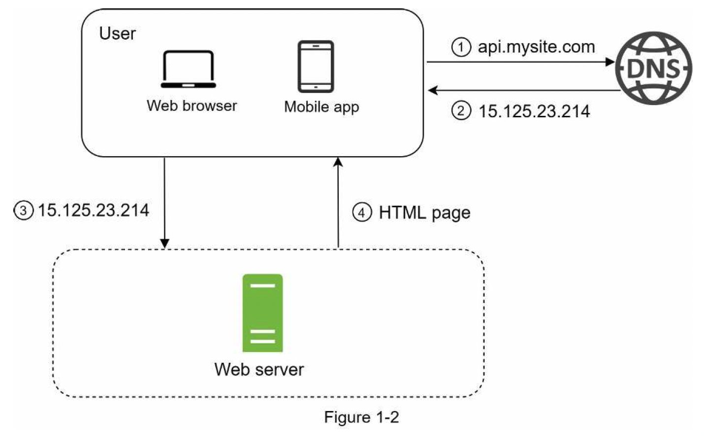

1. Users access websites through domain names, such as api.mysite.com. Usually, the
   Domain Name System (DNS) is a paid service provided by 3rd parties and not hosted by
   our servers.
2. Internet Protocol (IP) address is returned to the browser or mobile app. In the example,
   IP address 15.125.23.214 is returned.
3. Once the IP address is obtained, Hypertext Transfer Protocol (HTTP) requests are
   sent directly to your web server.
4. The web server returns HTML pages or JSON response for rendering.

### Database

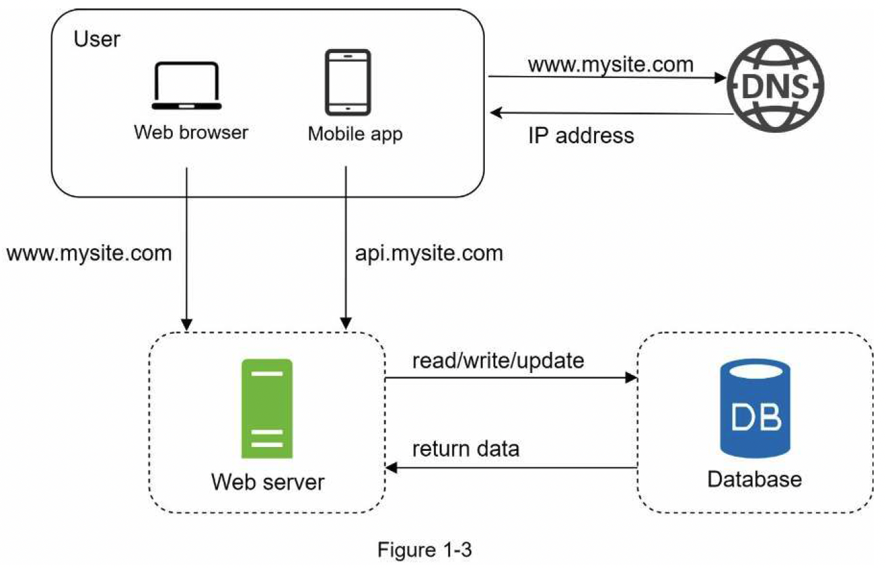

- The setup so far can be termed as the `web tier`, and we can add an additional server, a database, as the `data tier`.
- Adding this additional database server allows us to scale the system independently.

#### There are two types of databases:

- _Relational Database (RDBMS) (SQL Database)_: represent and store data in tables and rows. Ex: MySQL, PostgreSQL, etc. (JOIN operations supported).
- _Non-Relational Database (NRDBMS) (NoSQL Database)_: grouped into four categories: `key-value stores`, `graph stores`, `column stores`, and `document stores`. Ex: MongoDB, Amazon DynamoDB, etc. (JOIN operations, usually not supported).

#### Some situations where using NRDBMS is a right choice:

- The application requires super-low latency.
- The data is not structured and is not relational.
- Need to store massive amount of data.
- Need to serialize and deserialize data (JSON, XML, YAML, etc.)

#### Serialization

This refers to the process of converting data into a stream of bytes/data for machine-readability. Ex:

```sh
    let obj = {
        name: 'Jane Doe'
    }
    let serializedValue = JSON.stringify(obj);
    console.log(serializedValue);
    // '{"name":"Jane Doe"}'
```

#### Deserialization

This refers to the process of converting machine-readable stream of bytes/data to a human-readable format. Ex:

```sh
    let obj = '{"name":"Jane Doe"}';
    let deserializedValue = JSON.parse(obj);
    console.log(deserializedValue);
    /*
        {
        name: 'Jane Doe'
        }
    */
```

### Vertical Scaling VS Horizontal Scaling

- _Vertical Scaling (Scale UP)_: The process of adding more power to the servers (CPU, RAM, etc). Small-scale applications with low traffic.
- _Horizontal Scaling (Scale OUT)_: The process of adding more servers to the pool of resources. Large-scale applications with high traffic.

#### Limitations of Vertical Scaling

- You cannot add infinite power to a single server.
- Cannot address failover and redundancy. If one server fails, the application goes down with it completely.

#### Limitations of Horizontal Scaling

- Designing, implementing, and managing distributed systems is inherently more complex than single-node systems.
- Horizontal scaling typically requires communication between nodes over a network. This introduces network overhead, which can lead to latency and potential bottlenecks, especially when data needs to be transferred between nodes frequently.

### Load Balancer

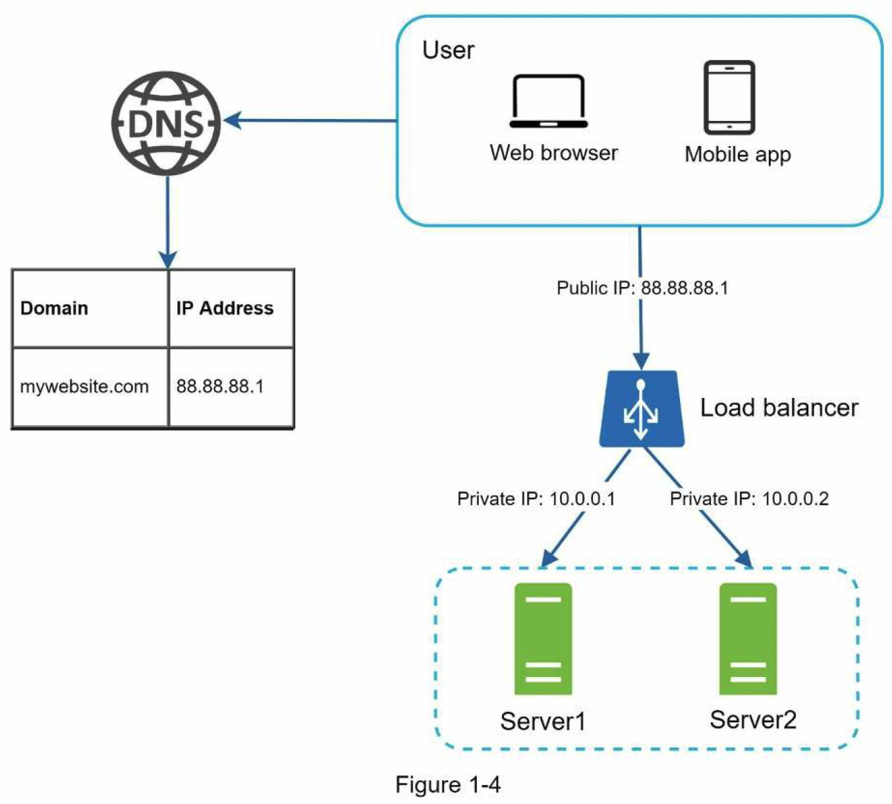

Using a load balancer is a technique of implementing horizontal scaling. Imagine the following scenarios:

- We have a single-server system and the server goes down. The application is unaccessible to the users.
- We have multiple servers but a majority of the requests have been sent to a single server and it reaches it's load limit. The users start experiencing slower responses or fail to connect to the server, etc.

Using a load balancer is the best technique to address these problems.

A `load balancer` evenly distributes incoming traffic among web servers that are defined in a load-balanced set.

#### In Figure 1-4:

- Users connect to the public IP of the load balancer rather than directly connecting to the servers.
- The load balancer communicates with the servers through private IPs and responds back to the users

#### Advantages:

- Security: We have introduced security to the system by preventing users from communicating with the servers directly.
- Improved Availability and No Failovers: Whenever a server goes down, the load balancer makes a note of it, redirects the requests to a healthy server and also adds a new healthy server.
- Improved Performance: When there is a high traffic, the load balancer distributes the requests between the servers to prevent server-overloading, resulting in improved response time and better system performance .
- Scalability: Load balancers make it easier to scale your application horizontally by adding more servers to handle increased traffic. This scalability is essential for growing businesses and handling sudden traffic spikes.
- Traffic Management: Load balancers can route traffic based on various criteria, such as URL paths, request headers, or session persistence. This allows for fine-grained control over how traffic is distributed, optimizing resource allocation.

#### Disadvantages:

- Complexity: Implementing and managing load balancers can add complexity to your infrastructure. Configuration, monitoring, and troubleshooting may require additional expertise and resources.
- Single Point of Failure: While load balancers are designed for high availability, they can themselves become a single point of failure. To mitigate this, redundant load balancers and failover mechanisms are often employed.
- Scaling Limitations: Load balancers have their own scalability limits. While they can distribute traffic to many backend servers, they can become bottlenecks themselves if not properly sized.

#### Public IP vs Private IP

- Public IPs are accessible via the internet.
- Private IPs are accessible only to servers within the same network and are not reachable over the internet.

### Database Replication

Database Replication is used to support failover and redundancy in the cases where the single database fails. This process usually follows a master/slave relationship between the original (master) and the copies (slaves).

Master -> Handles all data-modifying commands
Slaves -> Gets copies of data from the Master and handles only read commands.

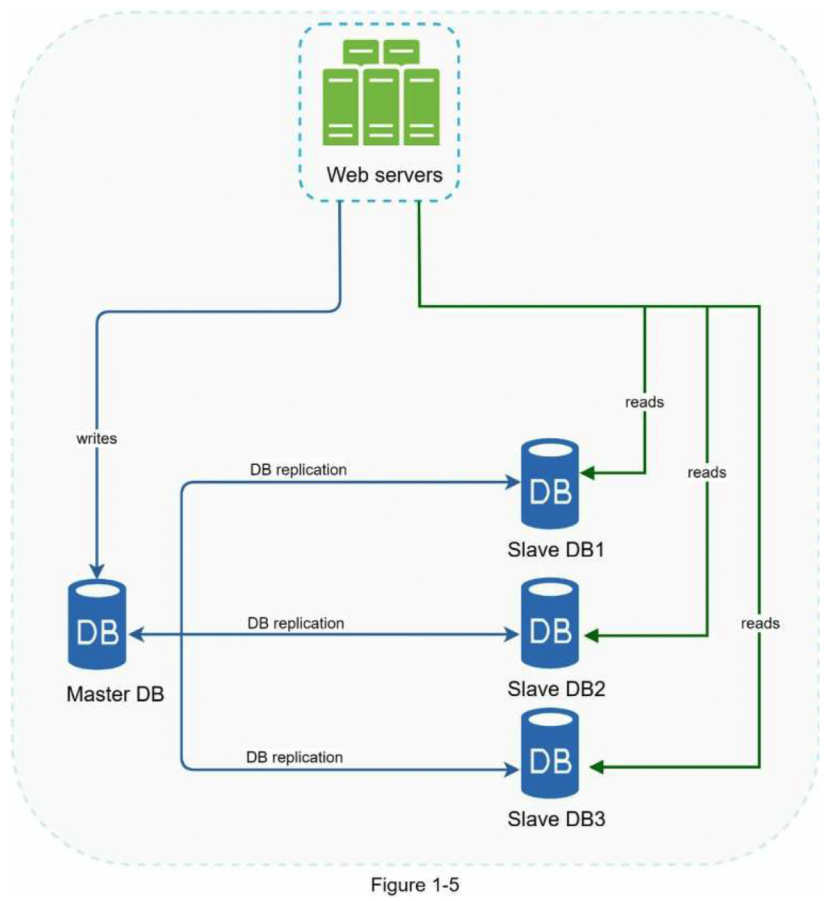

#### In Figure 1-5:

- If only one slave db is available and it goes offlone, then all the read operations are directed to the master db temporarily. And if there were more slave dbs, then the read operations would be redirected to other healthy databases. In the background, a new db server will replace the old db server.
- If the master db fails, one of the slave databases is temporarily promoted into a master db and all operations are performed on this new master db. The new server replaces the old one and data replication takes place immediately.

_Note:_ This maybe difficult to achieve in productions systems as the data in the slave db might not be up-to-date. Complex methods like running data recovery scripts, multi-masters, and circular replication could help but are too complicated to implement.

#### Advantages

- Better performance: write & update operations => master nodes; read operations => slave nodes; allows more queries to be processed in parallel.
- Reliability: need not worry about data loss because data is replicated across multiple servers.
- High availability: since data is replicated across different servers, even if one database goes offline, the application can fetch data from other database servers.

#### Disadvantages

- Complexity: Implementing and managing database replication can be complex. It requires careful configuration and monitoring to ensure data consistency and synchronization.
- Resource Utilization: Replicas consume server resources (CPU, memory, disk I/O). As you add more replicas, you need to allocate additional resources to maintain them.
- Consistency Challenges: Achieving and maintaining data consistency between the primary and replica databases can be challenging.

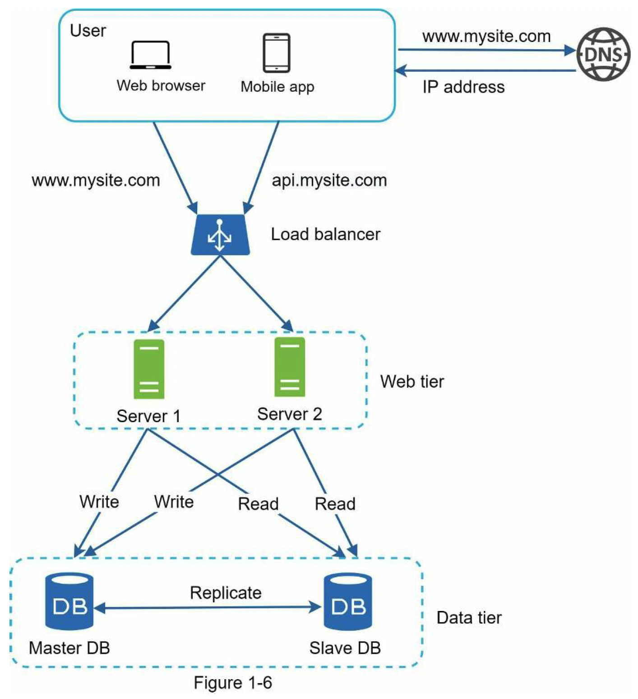

- A user gets the IP address of the load balancer from DNS.
- A user connects the load balancer with this IP address.
- The HTTP request is routed to either Server 1 or Server 2.
- A web server reads user data from a slave database.
- A web server routes any data-modifying operations to the master database. This includes
  write, update, and delete operations.

### Cache

A cache is a temporary storage area that stores data which is a result of expensive computations or is frequently accessed. This allows quicker responses.

We can add a `cache tier` to the current system design to improve the `load/response time`. The `cache tier` is a temporary data store layer which is much faster than the database. The benefits:

- A better system performance
- Ability to reduce database workloads

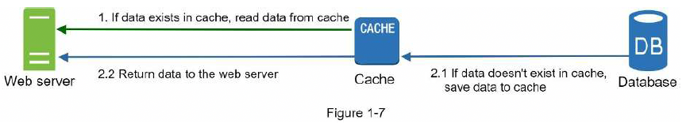

This caching strategy is called a **read-through** cache.

#### Considerations for using Cache

- Consider using a cache in situations where data is read frequently but modified infrequently.
- Prevent storing important data in cache as the cache memory is lost whenever restarted.
- Consider setting an expiration date on the cache memory. Make sure it is neither too short nor too long.
- Data modifying operations on the data store and cache are not in a single transaction and therefore, steps must be taken to maintain consistency, especially while scaling.
- Having a single cache presents a chance of a single point of failure. Therefore, it is advised to maintain multiple cache servers.
- We also have to deal with cases where the cache is full, at which point, we need to adopt an eviction policy. EX: least-recently-used (LRU), least-frequently-used (LFU), first-in-first-out (FIFO), etc.

### CDN

CDN->Content Delivery Network
A CDN is a network of servers spread out geographically inorder to deliver static content in a secure and static way. CDN servers cache static content like images, videos, CSS, JS files, etc.

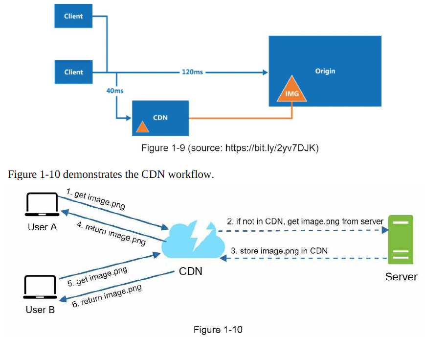

1. User A tries to get image.png by using an image URL. The URL’s domain is provided
   by the CDN provider. The following two image URLs are samples used to demonstrate
   what image URLs look like on Amazon and Akamai CDNs:
   • https://mysite.cloudfront.net/logo.jpg
   • https://mysite.akamai.com/image-manager/img/logo.jpg
2. If the CDN server does not have image.png in the cache, the CDN server requests the
   file from the origin, which can be a web server or online storage like Amazon S3.
3. The origin returns image.png to the CDN server, which includes optional HTTP header
   Time-to-Live (TTL) which describes how long the image is cached.
4. The CDN caches the image and returns it to User A. The image remains cached in the
   CDN until the TTL expires.
5. User B sends a request to get the same image.
6. The image is returned from the cache as long as the TTL has not expired.

#### Considerations for using CDN:

- CDNs are run by 3rd-party providers and can be very expensive as we are charged for data transfers in and out of the CDN.
- It is better to keep clearing out unused files from the CDN to free space.
- We should consider setting a cache expiry time that is neither too long nor to short.
- We should have a failsafe to deal with temporary CDN outages allowing clients to detect the problem and request the origin directly.
- Invalidating files: You can remove a file from the CDN before it expires by performing
  one of the following operations:
  - Invalidate the CDN object using APIs provided by CDN vendors.
  - Use object versioning to serve a different version of the object. To version an object,
    you can add a parameter to the URL, such as a version number. For example, version
    number 2 is added to the query string: image.png?v=2.

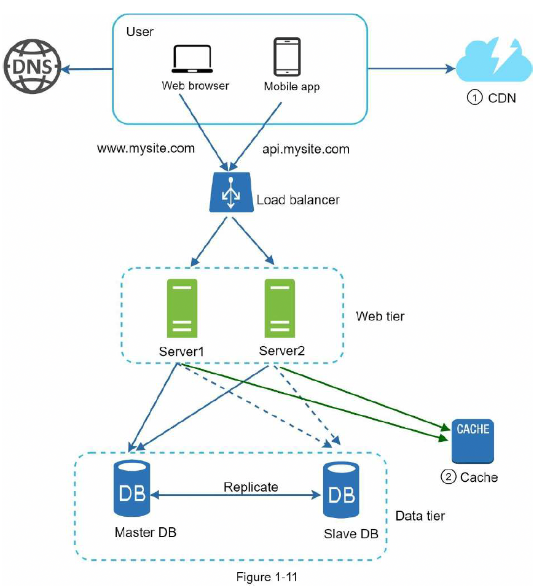

1. Static assets (JS, CSS, images, etc.,) are no longer served by web servers. They are
   fetched from the CDN for better performance.
2. The database load is lightened by caching data.

### Stateless Web Tier

In order to scale the web tier horizontally, we can move state data out of the web tier. We can do so by storing state data in persistent storage such as a relational database or NoSQL. Therefore, any web server in the cluster can access state data from the database. This is called stateless web tier.

#### Stateful Architecture

A stateful server remembers client data (state) from one request to the next.
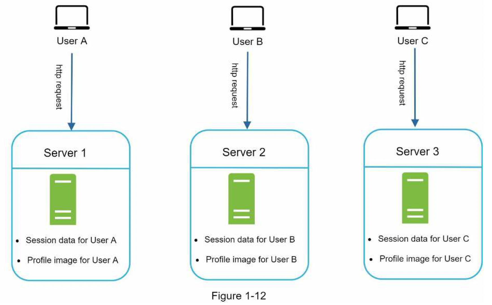
The issue here is that every request from the same client must be routed to the same server. While this can be achieved using sticky sessions, this adds overhead and it gets difficult to handle server failures.

#### Stateless Architecture

A stateless server keeps no state information.
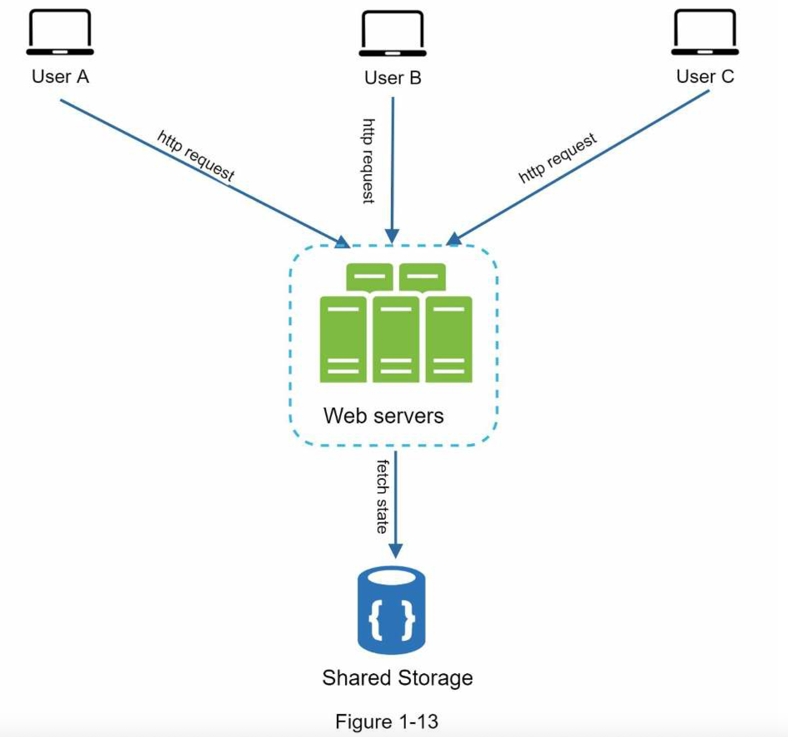
A stateless system is simpler, more robust, and scalable.

#### Stateless Web Server

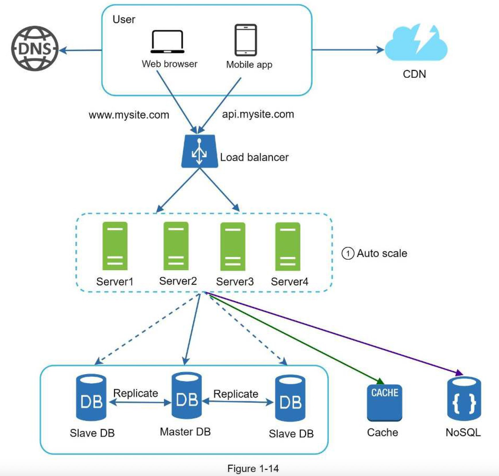
In Figure 1-14, we move the session data out of the web tier and store them in the persistent data store. The shared data store could be a relational database, Memcached/Redis, NoSQL, etc. The NoSQL data store is chosen as it is easy to scale.

`Autoscaling means adding or removing web servers automatically based on the traffic load.`

After the state data is removed out of web servers, auto-scaling of the web tier is easily achieved by adding or removing servers based on traffic load.

### Data Centers

In such a scenario, it is preferable to add multiple `data centers` spread across a wide geographical area. A `data center` is a centralized facility used for the storage, processing, management, and distribution of data and IT resources.

`geoDNS` (geographic Domain Name System) is a service that allows domain names to be resolved to IP addresses based on the location of a user. This approach is used to improve the performance and user experience by directing users to servers or data centers that are geographically closer to them. By doing so:

- It reduces the response time for users, as data is served from a location that minimizes `network latency`, resulting in faster access to web content or services.
- It allows customization of content based on user's location. Ex: serving different language versions or region-specific content to enhance user relevance and engagement.
- It allows us to deal with server failures by redirecting the traffic to the next closest server in order to ensure continuity of service.

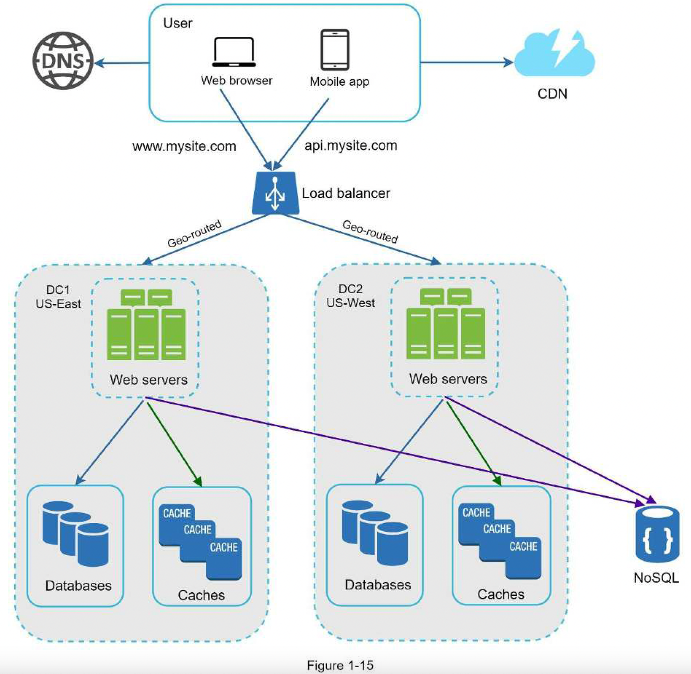

`Virtualization` is the process of creating multiple virtual instances of physical hardware or software resources. In data centers, server virtualization is common, where a single physical server hosts multiple virtual machines (VMs). Benefits include:

- Resource Utilization: Efficiently use server resources by running multiple VMs on a single physical server.
- Isolation: Isolate applications and services in separate VMs, enhancing security and stability.
- Flexibility: Easily scale up or down by creating or removing VMs as needed.
- Disaster Recovery: VM snapshots and migration enable quick disaster recovery and backup strategies.

#### Key technical challenges and solutions involved in setting up a multi-data center infrastructure

Setting up a multi-data center infrastructure involves addressing several technical challenges. Let's break them down:

1. Traffic Redirection:

   `Challenge:` How do you effectively redirect traffic to the correct data center in a multi-data center setup to ensure users are served from the nearest location?
   `Solution:` GeoDNS can be used to direct traffic based on user location, ensuring low latency and optimal performance. GeoDNS resolves domain names to IP addresses based on geographic proximity.

2. Data Synchronization:

   `Challenge:` How do you handle data synchronization across multiple data centers to ensure consistency and availability, especially in the event of failovers?
   `Solution:` Data replication is a common strategy. Data can be replicated asynchronously or synchronously between data centers. Techniques like active-passive or active-active replication can be employed based on the requirements.

3. Test and Deployment:

   `Challenge:` What tools and strategies are essential for testing and deploying services in a multi-data center setup, and how do you maintain consistency?
   `Solution:` Automated deployment tools play a crucial role. Tools like container orchestration platforms (e.g., Kubernetes) and configuration management tools (e.g., Ansible) help ensure consistent deployments across data centers. Automated testing suites and continuous integration/continuous deployment (CI/CD) pipelines are vital for thorough testing.

### Message Queue

A message queue is a durable component, stored in memory, that supports asynchronous communication. It serves as a buffer and serves asynchronous requests.

#### Basic Architecture of a message queue

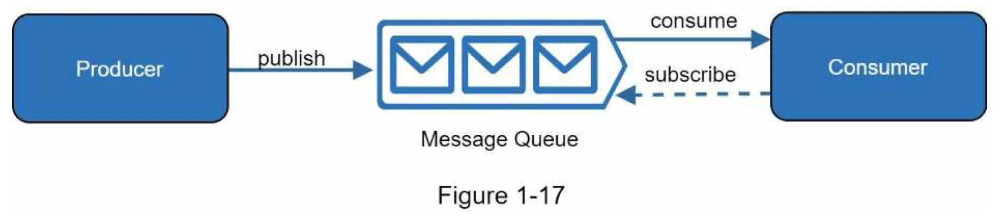]

- _Input services_ called **producers/publishers** create messages and publish them to the message queue.
- Other _services or servers_ called **consumers/subscribers** connect to the queue, and perform actions defined by the messages.
- With the message queue, the producer can post a message to the queue
  when the consumer is unavailable to process it. The consumer can read messages from the queue even when the producer is unavailable.

#### Photo Customizing Application Scenario

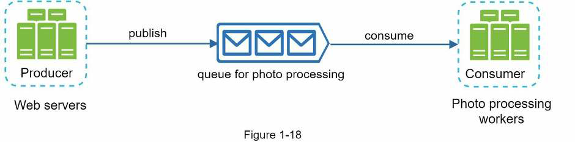
The customization tasks take time to complete. In Figure 1-18, web servers (_producers_) publish photo processing jobs to the message queue. Photo processing workers (_consumers_) pick up jobs from the message queue and asynchronously perform photo customization tasks. The producer and the consumer can be scaled independently. When the size of the queue becomes large, more workers are added to reduce the processing time.
However, if the queue is empty most of the time, the number of workers can be reduced.

### Logging, Metrics, Automation

- **Logging:** Monitoring error logs is important because it helps to identify errors and problems in the system. You can monitor error logs at per server level or use tools to aggregate them to a centralized service for easy search and viewing.
- **Metrics:** Collecting different types of metrics help us to gain business insights and understand the health status of the system. Some of the following metrics are useful:
  - Host level metrics: CPU, Memory, disk I/O, etc.
  - Aggregated level metrics: for example, the performance of the entire database tier, cache tier, etc.
  - Key business metrics: daily active users, retention, revenue, etc.
- **Automation:** When a system gets big and complex, we need to build or leverage automation tools to improve productivity. Continuous integration is a good practice, in which each code check-in is verified through automation, allowing teams to detect problems early. Besides, automating your build, test, deploy process, etc. could improve developer productivity significantly.

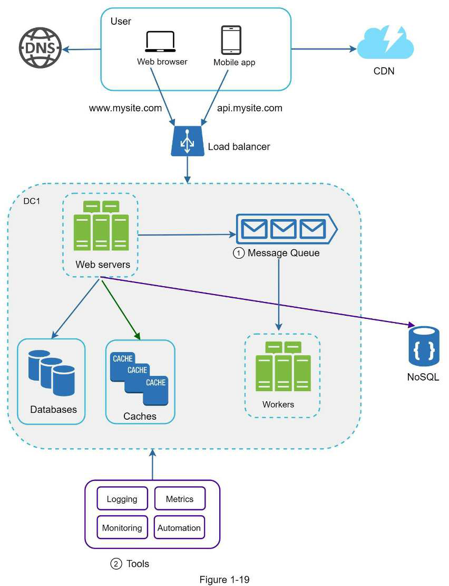

1. The design includes a message queue, which helps to make the system more loosely coupled and failure resilient.
2. Logging, monitoring, metrics, and automation tools are included.

### Database Scaling

The two approaches for database scaling are:

- **Vertical Scaling**

  Also known as `scaling up`, is the scaling by adding more power like CPU, RAM, DISK, etc. to an existing server. Drawbacks:

  - hardware limits of how powerful you can make a single server.
  - greater risk of single point of failures
  - powerful servers are expensive, therefore, overall cost of vertical scaling is high.

- **Horizontal Scaling**

  Also known `sharding`, is the practice of adding more servers. Sharding separates large databases into smaller, more easily managed parts called shards. Each shard shares the same schema, though the actual data on each shard is unique to the shard.

#### Database Sharding

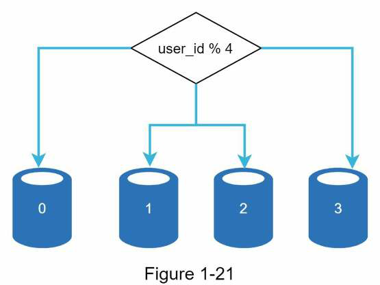
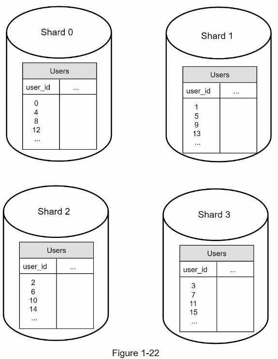
Figure 1-21 shows an example of sharded databases. User data is allocated to a database server based on user IDs. Anytime you access data, a hash function is used to find the corresponding shard. In our example, `user_id % 4` is used as the hash function. If the result equals to 0, shard 0 is used to store and fetch data. If the result equals to 1, shard 1 is used. The same logic applies to other shards.

#### Sharding Key

The most important factor to consider when implementing a sharding strategy is the choice of the `sharding key`/`partition key`.

It consists of one or more columns that determine how data is distributed. A sharding key allows you to retrieve and modify data efficiently by routing database queries to the correct database.

NOTE: It is important to choose a key that can evenly distribute data.

#### Sharding: Complexities & Challenges

1. Resharding Data

   Resharding data is needed when 1) a single shard could no longer hold more data due to rapid growth. 2) Certain shards might experience shard exhaustion faster than others due to uneven data distribution. When shard exhaustion happens, it requires updating the sharding function and moving data around.

   Solution: Consistent Hashing

2. Celebrity Problem

   This is also called a `hotspot key problem`. Excessive access to a specific shard could cause server overload. Imagine data for Katy Perry, Justin Bieber, and Lady Gaga all end up on the same shard. For social applications, that shard will be overwhelmed with read operations.

   Solution: To solve this problem, we may need to allocate a shard for each celebrity. Each shard might even require further partition.

3. Join and De-Normalization

   Once a database has been sharded across multiple servers, it is hard to perform join operations across database shards.

   Solution: A common workaround is to denormalize the database so that queries can be performed in a single table.

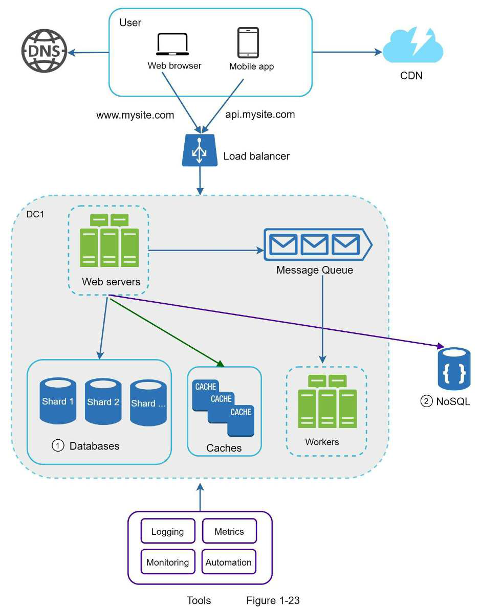

1. we shard databases to support rapidly increasing data traffic.
2. some of the non-relational functionalities are moved to a NoSQL data store to reduce the database load.

