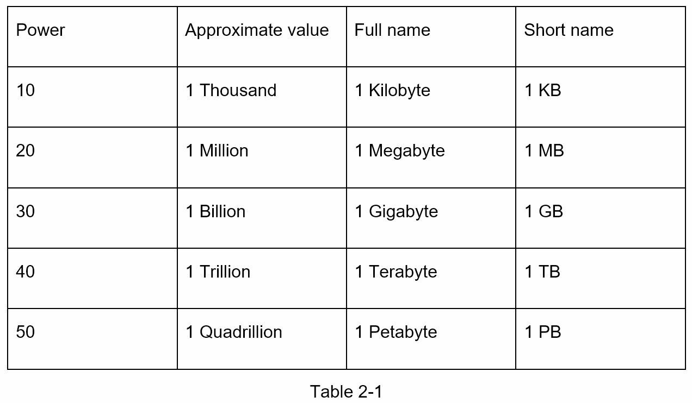

## Chapter 2: Back-Of-The-Envelope Estimation

“back-of-the-envelope calculations are estimates you create using a combination of thought experiments and common performance numbers to get a good feel for which designs will meet your requirements”

### Power of Two

### Latency Numbers every Programmer should know

#### Notes

- ns = nanosecond, μs = microsecond, ms = millisecond
- 1 ns = 10^-9 seconds
- 1 μs= 10^-6 seconds = 1,000 ns
- 1 ms = 10^-3 seconds = 1,000 μs = 1,000,000 ns

By analyzing the numbers in Figure 2-1, we get the following conclusions:

- Memory is fast but the disk is slow.
- Avoid disk seeks if possible.
- Simple compression algorithms are fast.
- Compress data before sending it over the internet if possible.
- Data centers are usually in different regions, and it takes time to send data between them.

### Availability Numbers

High availability is the ability of a system to be continuously operational for a desirably long period of time.

A `service level agreement (SLA)` is a commonly used term for service providers. This is an agreement between you (the service provider) and your customer, and this agreement formally defines the level of uptime your service will deliver. Uptime is traditionally measured in nines. The more the nines, the better.

### Estimate Twitter QPS and storage requirements

Please note the following numbers are for this exercise only as they are not real numbers
from Twitter.

_Assumptions_:

- 300 million monthly active users.
- 50% of users use Twitter daily.
- Users post 2 tweets per day on average.
- 10% of tweets contain media.
- Data is stored for 5 years.

_Estimations_:

  Query per second (QPS) estimate:
  - Daily active users (DAU) = 300 million \_ 50% = 150 million
  - Tweets QPS = 150 million \_ 2 tweets / 24 hour / 3600 seconds = ~3500
  - Peek QPS = 2 \_ QPS = ~7000
  
  We will only estimate media storage here.

- Average tweet size:
  - tweet_id 64 bytes
  - text 140 bytes
  - media 1 MB
- Media storage: 150 million _ 2 _ 10% \_ 1 MB = 30 TB per day
- 5-year media storage: 30 TB _ 365 _ 5 = ~55 PB
