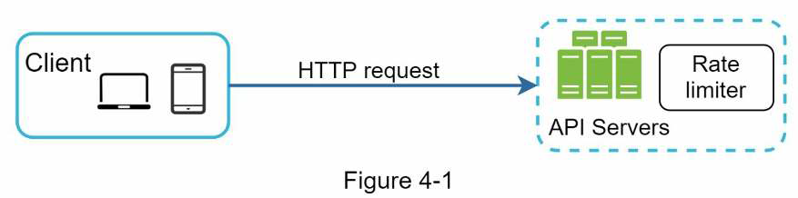
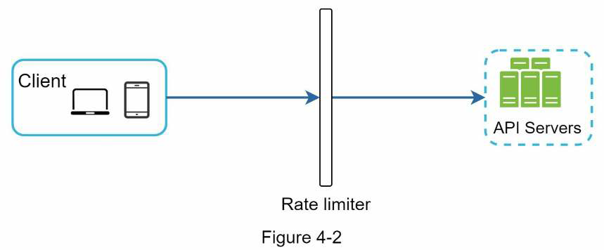

## Chapter 4: Design a Rate Limiter

A `rate limiter` is used to control the rate of traffic sent by a user or a service. In the context of HTTP, a rate limiter limits the number of client requests allowed to be sent over a specified period. If the API requests exceed the threshold set by the rate limiter, all the excess calls are blocked.

### API Rate Limiter: Benefits
- Prevents resource starvation caused by Denial of Service (DoS) attacks by blocking the excess calls.
- Reduce costs: Limiting excess requests means fewer servers and allocating more resources to APIs of high priority.
- Prevents servers from being overloaded.

### Clarification Questions
- Is it a client-side rate limiter, server-side rate limiter or do we want to place it a middleware?
- Does the rate limiter throttle requests based IP address, the user ID, or any other properties?
- What is the scale of the system? Is it built for a startup or a big company with a large user base?
- Will the system work in a distributed environment?
- Is the rate limiter a separate service or should it be implemented in the application code?
- Do we need to inform the users who are throttled?

### Where to place the rate limiter?
1. **Client-side Implementation**
   
   We can place a rate limiter on the client-side but this can be unreliable as client requests can easily be forged by mailcious actors.
2. **Server-side Implementation**
   
   

3. **Rate Limiter as a Middleware**
   
   
   We can create a rate limiter middleware which throttles the excess requests before sent to the server.

`The HTTP 429 response status code indicates a user has sent too many requests.`

An `API Gateway` is a fully managed service that supports rate limiting, SSL termination, authentication, IP Whitelisting, servicing static content, etc.

